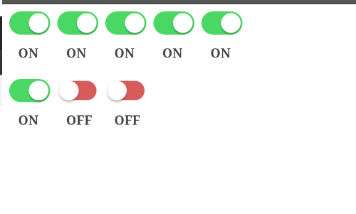

# New_Riego

### En esta primera seccion hemos hecho el primer apartado del examen. Este primer apartado consisitia en modificar el texto del checkbutton dependiendo de si su estado estuviera a false o true.

#### para la realizacion de dicho apartado unicamente he tocado el check.js

##### Captura del codigo hecho: 

### En esta segunda seccion he hecho el segundo apartado del examen. Este segundo apartado consistia en obtener los grupos de valvulas y sus valvulas correspondientes del servidor y una vez hecho eso pintarlo con la configuracion que nos viene del servidor.

#### Para la realizacion de dicho apartado he creado una constante ServiceClient que es el objeto que se va a encargar de manejar la conexion entre el cliente y el servidor. Tiene un metodo getChecksServed que me devuelve las valvulas del servidor con sus grupos.

#### Ademas he creado una clase UI para manejar el apartado grafico del cliente.

##### Captura de como ha quedado: 

#### En esta imagen se pueden ver las valvulas creadas correctamente y cada una con el estado que le llega del servidor.

### En esta ultima seccion he hecho el ultimo apartado del examen. Este ultimo apartado consistia en mantener el estado de las valvulas aunque se recargara la pagina o se cambiara de pestaña.

#### Para la realizacion de dicha tarea he creado un metodo en mi constante ServiceClient llamado sendCheckStatus que se va a encargar de enviarle al servidor el estado de la valvula. Una vez ahi he configurado el servidor de tal manera que los datos se modifiquen de manera adecuada, modificando el estado solo de la valvula cambiada. ¿Como lo he hecho? he agregado un campo id a las valvulas para que de esa manera se mas sencillo identificar las valvulas dentro del grupo en concreto. 

##### Antes de recargar la pagina 

##### Despues de recargar la pagina

